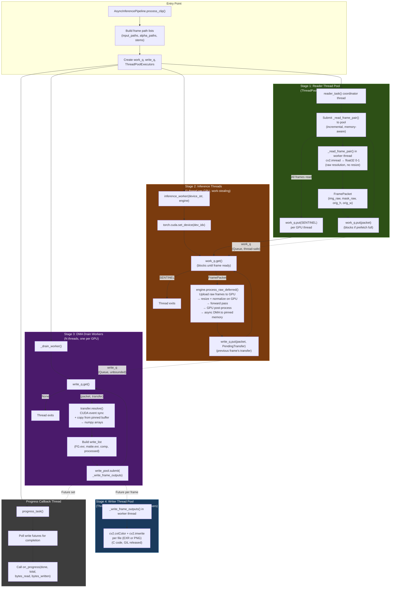

# CorridorKey Async Pipeline Flowchart

## Pipeline Architecture

The pipeline uses **thread-based concurrency** throughout. Reader and writer
threads achieve real parallelism because their hot paths (`cv2.imread`,
`cv2.imwrite`, `cv2.cvtColor`) are C code that **releases the GIL**. GPU
inference also releases the GIL during CUDA kernel execution.

A 4-stage pipeline overlaps reading, inference, DMA transfer, and writing
across frames:



### Concurrency Architecture

```
       Reader Threads           GPU Threads          Drain Threads         Writer Threads
    ┌──────────────────┐   ┌──────────────────┐   ┌────────────────┐   ┌──────────────────┐
    │  Read Worker 1   │─┐ │  GPU:0 Inference │─┐ │ Drain Worker 0 │─┐ │  Write Worker 1  │
    │  Read Worker 2   │─┤ │                  │ │ │ Drain Worker 1 │ │ │  Write Worker 2  │
    │  ...             │─┤ │  GPU:1 Inference │─┤ │ ...            │─┤ │  ...             │
    │  Read Worker N   │─┘ │  (work-stealing) │ │ │                │ │ │  Write Worker M  │
    └──────────────────┘   └──────────────────┘ │ └────────────────┘ │ └──────────────────┘
      ThreadPoolExecutor     threading.Thread   │   threading.Thread │   ThreadPoolExecutor
       cpu_count // 4         1 per GPU         │    1 per GPU       │    cpu_count // 4
            │                                   │         │          │         │
            ▼                                   │         ▼          │         ▼
       work_q (Queue)      PendingTransfer ─────┘    write_q (Queue) ┘    EXR/PNG output
    (prefetch: gpus × 8)   (async DMA via            (unbounded)
                            copy stream)
```

### Data Flow Per Frame

```
Input files on disk
    │
    ▼
_read_frame_pair()          [Reader Thread]
    cv2.imread → float32 0-1
    No resize (raw resolution preserved)
    │
    ▼ FramePacket(img_raw, mask_raw, orig_h, orig_w)
    │
    ▼
engine.process_raw_deferred()   [GPU Thread]
    torch.as_tensor → GPU upload
    F.interpolate → resize to model size
    ImageNet normalize
    Model forward pass
    GPU post-process (despill, sRGB, composite, despeckle)
    F.interpolate → resize to output resolution
    Async DMA to pinned CPU buffer (copy stream)
    │
    ▼ PendingTransfer (non-blocking)
    │
    ▼
transfer.resolve()          [Drain Thread]
    CUDA event synchronize
    Copy from pinned buffer → numpy arrays
    Release pinned buffer slot
    │
    ▼ ResultPacket {alpha, fg, comp, processed}
    │
    ▼
_write_frame_outputs()      [Writer Thread]
    cv2.cvtColor (color space conversion)
    cv2.imwrite (FG.exr, matte.exr, comp.exr/png, processed.exr)
    │
    ▼
Output files on disk
```

### GIL Analysis

| Component | Executor | GIL Impact |
|-----------|----------|------------|
| Frame reading (`cv2.imread`) | ThreadPoolExecutor | **Minimal** — `cv2.imread` is C code, releases GIL |
| Inference (CUDA kernels) | threading.Thread | **None** — PyTorch releases GIL during CUDA ops |
| Tensor upload (`torch.as_tensor().to()`) | threading.Thread | **Brief** — GIL held for tensor creation |
| GPU post-processing | threading.Thread | **None** — torch ops release GIL |
| DMA resolve (pinned copy) | threading.Thread | **Brief** — `memcpy` from pinned buffer |
| File writing (`cv2.imwrite`) | ThreadPoolExecutor | **Minimal** — C code, releases GIL |
| Color conversion (`cv2.cvtColor`) | ThreadPoolExecutor | **Minimal** — C code, releases GIL |

### What Runs Where

| Work | Location |
|------|----------|
| `cv2.imread` + decode to float32 | Reader thread (ThreadPool) |
| Resize to model size | **GPU** (`F.interpolate` in `process_raw`) |
| ImageNet normalize + concat | **GPU** (tensor ops in `process_raw`) |
| Model forward pass | **GPU** (inference thread) |
| Despill, sRGB, composite | **GPU** (torch ops in `_postprocess_gpu`) |
| Matte despeckle (morphological ops) | **GPU** (torch erosion/dilation) |
| Checkerboard generation | **GPU** (cached, one-time allocation) |
| Resize to output resolution | **GPU** (`F.interpolate`) |
| DMA GPU → CPU | Copy stream (async, pinned memory) |
| DMA resolve (sync + memcpy) | Drain thread |
| Color space conversion for output | Writer thread (cv2, GIL released) |
| `cv2.imwrite` (EXR/PNG encode) | Writer thread (GIL released) |

### Flow Control & Backpressure

```
disk ← write_pool ← write_q ← inference ← work_q ← readers ← disk
```

- **`work_q`** (`Queue(maxsize=num_gpus * 8)`): throttles readers. When GPUs
  fall behind, the queue fills and readers block on `put()`.
- **`write_q`** (unbounded `Queue`): decouples inference from DMA resolve.
  Inference threads never block on numpy copies.
- **Memory-aware reader throttle**: `reader_task` monitors available system
  RAM via `/proc/meminfo` (Linux) or `GlobalMemoryStatusEx` (Windows). Pauses
  reading when free RAM minus one frame's estimated size would drop below 1 GB.
- **Write pool backpressure**: `ThreadPoolExecutor` internally queues excess
  tasks. No explicit semaphore needed.

### Thread Safety Mechanisms

| Component | Mechanism |
|-----------|-----------|
| Frame prefetch queue | `queue.Queue(maxsize=num_gpus * 8)` |
| Write dispatch queue | `queue.Queue()` (unbounded) |
| Write future tracking | `threading.Lock` protecting futures set |
| Shutdown signaling | `threading.Event` + `_SHUTDOWN` sentinel |
| DMA buffer slots | `threading.Event` per pinned buffer (acquire/release) |
| CUDA OOM handling | `try/except` with `torch.cuda.empty_cache()`, GPU taken offline |
| GPU resilience mode | OOM frames requeued to `work_q` for other GPUs |

### DMA Double/Triple Buffering

The inference engine uses 2-3 pinned CPU memory buffers (configurable via
`OptimizationConfig.dma_buffers`) for overlapping GPU→CPU transfers:

```
Frame N:     [Forward Pass]──[DMA to pinned buf 0]
Frame N+1:        [Forward Pass]──[DMA to pinned buf 1]
                       │
Drain Thread:    [Resolve buf 0]──[Write]
                           [Resolve buf 1]──[Write]
```

Each buffer slot is guarded by a `threading.Event`:
- Inference thread waits for a free slot before starting DMA
- Drain thread signals the slot as free after copying data out

---

## Profiling Infrastructure

CorridorKey includes a `_TimelineProfiler` that records span events across
all pipeline stages. At the end of a run it produces a console summary with
per-GPU statistics, phase durations, and throughput metrics.

Additionally, a `PerformanceMetrics` system in `optimization_config.py`
provides per-frame timing when enabled:

```python
import dataclasses
from CorridorKeyModule import OptimizedCorridorKeyEngine, OptimizationConfig

config = dataclasses.replace(OptimizationConfig.optimized(), enable_metrics=True)

engine = OptimizedCorridorKeyEngine(
    checkpoint="model.pth",
    device="cuda",
    img_size=2048,
    optimization_config=config,
)

result = engine.process_frame(img, alpha)

if "metrics" in result:
    print(result["metrics"].summary())
    #   inference   :  187.4 ms | VRAM peak: 3250 MB
    #   postprocess :    8.2 ms | VRAM peak: 3250 MB
    #   total       :  195.6 ms
```

### GPU Memory Polling

```python
import threading
import time
import torch

class VRAMPoller(threading.Thread):
    """Background thread sampling GPU memory at high frequency."""

    def __init__(self, device_idx: int = 0, interval_ms: int = 25):
        super().__init__(daemon=True)
        self.device_idx = device_idx
        self.interval = interval_ms / 1000
        self.samples = []
        self._stop = threading.Event()

    def run(self):
        while not self._stop.is_set():
            free, total = torch.cuda.mem_get_info(self.device_idx)
            self.samples.append({
                "time": time.perf_counter(),
                "used_mb": (total - free) / 1e6,
                "allocated_mb": torch.cuda.memory_allocated(self.device_idx) / 1e6,
            })
            time.sleep(self.interval)

    def stop(self):
        self._stop.set()
        self.join()
        return self.samples

# Usage:
# poller = VRAMPoller()
# poller.start()
# ... run inference ...
# samples = poller.stop()
# peak = max(s["used_mb"] for s in samples)
# print(f"Peak device VRAM: {peak:.0f} MB")
```
