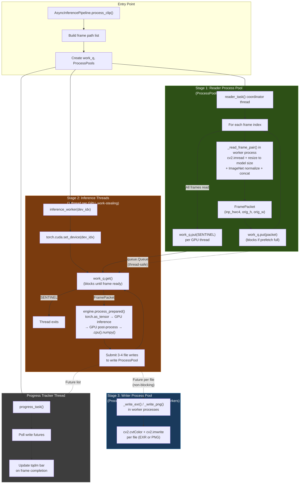

# CorridorKey Async Pipeline & Profiling Flowchart

## Async Method Usage Flow

The pipeline uses **process-based concurrency** for I/O (readers and writers) and **thread-based concurrency** for GPU inference (where CUDA releases the GIL). No `queue.Queue` connects inference to writing — inference submits directly to the write process pool via futures.



### Concurrency Architecture

```
       Reader Processes              GPU Threads              Writer Processes
    ┌──────────────────┐       ┌──────────────────┐       ┌──────────────────┐
    │  Read Worker 1   │──┐    │  GPU:0 Inference │──┐    │  Write Worker 1  │
    │  Read Worker 2   │──┤    │                  │  │    │  Write Worker 2  │
    │  ...             │──┤    │  GPU:1 Inference │──┼──► │  ...             │
    │  Read Worker N   │──┘    │  (work-stealing) │  │    │  Write Worker M  │
    └──────────────────┘       └──────────────────┘  │    └──────────────────┘
      ProcessPoolExecutor        threading.Thread    │      ProcessPoolExecutor
        cpu_count // 4           1 per GPU           │        cpu_count // 4
             │                                       │             │
             ▼                                       │             ▼
        work_q (Queue)           Futures submitted ──┘        EXR/PNG output
     (prefetch: gpus × 8)       (non-blocking, per-file)
```

### GIL Analysis

| Component | Type | GIL Impact |
|-----------|------|------------|
| Frame reading + preprocessing | ProcessPoolExecutor | **None** — each worker has its own interpreter |
| Inference (CUDA kernels) | threading.Thread | **None** — PyTorch releases GIL during CUDA ops |
| Inference (tensor creation) | threading.Thread | **Minimal** — single `torch.as_tensor().to(device)` |
| GPU post-processing | threading.Thread | **None** — torch ops release GIL |
| Final `.cpu().numpy()` | threading.Thread | **Brief sync** — one bulk transfer per frame |
| File writing + encoding | ProcessPoolExecutor | **None** — each writer has its own interpreter |

### What runs where

| Work | Before | After |
|------|--------|-------|
| cv2.imread + decode | ThreadPool (GIL shared) | **ProcessPool** (own GIL) |
| Resize to model size | Inference thread (GIL held) | **Reader process** (own GIL) |
| ImageNet normalize + concat | Inference thread (GIL held) | **Reader process** (own GIL) |
| Tensor creation | Inference thread (~50ms GIL) | Inference thread (~1ms GIL) |
| Model forward pass | Inference thread (GIL released) | Same |
| Resize to output resolution | CPU cv2.resize (GIL held) | **GPU F.interpolate** |
| Despill, sRGB, composite | CPU numpy (GIL held) | **GPU torch ops** |
| Matte cleanup (despeckle) | CPU cv2 roundtrip (GPU→CPU→GPU) | **GPU morphological ops** |
| Checkerboard generation | CPU numpy (95MB/frame alloc) | **GPU cached** (one-time) |
| EXR/PNG color conversion | Single writer thread (GIL held) | **ProcessPool** (own GIL) |
| cv2.imwrite | Single writer thread | **ProcessPool** (4 files parallel) |

### Thread Safety Mechanisms

| Component | Mechanism |
|-----------|-----------|
| Frame prefetch queue | `queue.Queue(maxsize=num_gpus * 8)` |
| Write future tracking | `threading.Lock` protecting futures list |
| Shutdown signaling | `threading.Event` + sentinel objects |
| GPU job exclusion | `threading.Lock()` in service.py (GUI path) |
| CUDA OOM handling | `try/except` with `torch.cuda.empty_cache()`, GPU taken offline |

---

## CPU vs GPU Usage Profiling Example

### Existing Profiling Infrastructure

CorridorKey has a `PerformanceMetrics` system in `optimization_config.py`:

```python
import dataclasses
from CorridorKeyModule import OptimizedCorridorKeyEngine, OptimizationConfig

# Enable metrics collection
config = dataclasses.replace(OptimizationConfig.optimized(), enable_metrics=True)

engine = OptimizedCorridorKeyEngine(
    checkpoint="model.pth",
    device="cuda",
    img_size=2048,
    optimization_config=config,
)

result = engine.process_frame(img, alpha)

if "metrics" in result:
    print(result["metrics"].summary())
    #   inference   :  187.4 ms | VRAM peak: 3250 MB
    #   postprocess :    8.2 ms | VRAM peak: 3250 MB
    #   total       :  195.6 ms
```

### Async Pipeline Timeline (Multi-frame, Multi-GPU)

With the async pipeline, all stages overlap across frames:

```
Frame:    1              2              3              4
          │              │              │              │
Process   ┌──────────┐   ┌──────────┐   ┌──────────┐   ┌──────────┐
Read:     │ decode+  │   │ decode+  │   │ decode+  │   │ decode+  │
          │ resize+  │   │ resize+  │   │ resize+  │   │ resize+  │
          │ normalize│   │ normalize│   │ normalize│   │ normalize│
          └────┬─────┘   └────┬─────┘   └────┬─────┘   └────┬─────┘
               ↓ work_q       ↓              ↓              ↓
GPU:0     ┌────────────┐      ┌────────────┐      ┌────────────┐
Infer:    │ .to(device)│      │ .to(device)│      │ .to(device)│
          │ forward()  │      │ forward()  │      │ forward()  │
          │ GPU post   │      │ GPU post   │      │ GPU post   │
          │ .cpu()     │      │ .cpu()     │      │ .cpu()     │
          └────┬───────┘      └────┬───────┘      └────┬───────┘
               │                   │                   │
GPU:1          ┌────────────┐      ┌────────────┐
Infer:         │ .to(device)│      │ .to(device)│
               │ forward()  │      │ forward()  │
               │ GPU post   │      │ GPU post   │
               │ .cpu()     │      │ .cpu()     │
               └────┬───────┘      └────┬───────┘
                    │                   │
               ↓ submit futures    ↓
Process   ┌────┐┌────┐┌────┐  ┌────┐┌────┐┌────┐
Write:    │ FG ││Matt││Comp│  │ FG ││Matt││Comp│  ...
          │.exr││.exr││.png│  │.exr││.exr││.png│
          └────┘└────┘└────┘  └────┘└────┘└────┘

Timeline:  ──────────────────────────────────────────→
           0ms      200ms    400ms    600ms    800ms

Throughput: ~1 frame per GPU inference time (I/O fully hidden)
```

### GPU Memory Polling

```python
import threading
import time
import torch

class VRAMPoller(threading.Thread):
    """Background thread sampling GPU memory at high frequency."""

    def __init__(self, device_idx: int = 0, interval_ms: int = 25):
        super().__init__(daemon=True)
        self.device_idx = device_idx
        self.interval = interval_ms / 1000
        self.samples = []
        self._stop = threading.Event()

    def run(self):
        while not self._stop.is_set():
            free, total = torch.cuda.mem_get_info(self.device_idx)
            self.samples.append({
                "time": time.perf_counter(),
                "used_mb": (total - free) / 1e6,
                "allocated_mb": torch.cuda.memory_allocated(self.device_idx) / 1e6,
            })
            time.sleep(self.interval)

    def stop(self):
        self._stop.set()
        self.join()
        return self.samples

# Usage:
# poller = VRAMPoller()
# poller.start()
# ... run inference ...
# samples = poller.stop()
# peak = max(s["used_mb"] for s in samples)
# print(f"Peak device VRAM: {peak:.0f} MB")
```
